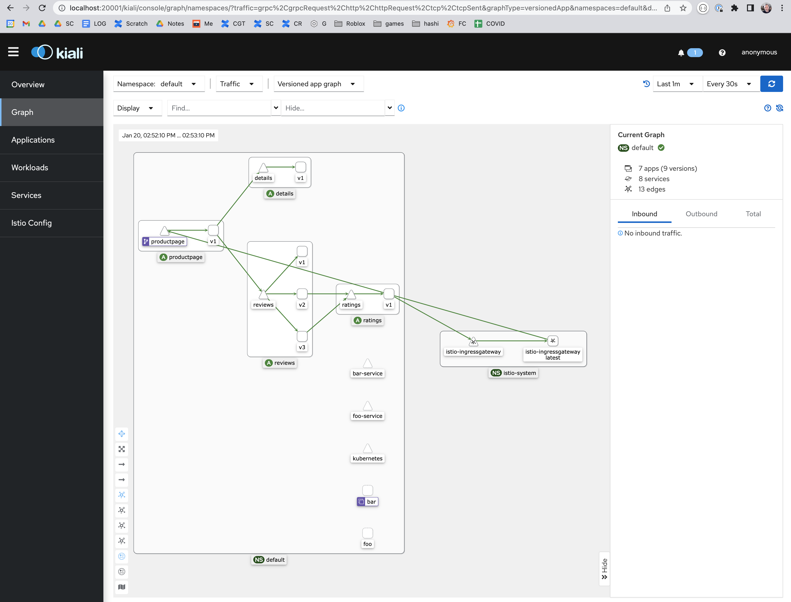

# Example cluster setup

This is a playground for trying out stuff. Try running `make`

Make targets:
* install: install kind, kubectl, istio (mac)
  * install-kind: install just kind and k8s
  * install-istio: install istio including istioctl
* create: create a cluster and ingress
* list: see how it's doing
* test-app: test the ingress with a couple of apps: foo and bar
* test-istio-app: install istio bookinfo demo app
* istio-ui: launch grafana, and the kiali dashboard
* clean: tear it all down
* help: this list

Pre-requisities:
* You will need docker installed and running, such as [Docker Desktop](https://docs.docker.com/desktop/install/mac-install/)
* There's a `make install-mac` which covers these below
* [Kubectl](https://kubernetes.io/docs/reference/kubectl/)
  * [Install Instructions](https://kubernetes.io/docs/tasks/tools/#kubectl)
  * [Mac Install](https://kubernetes.io/docs/tasks/tools/install-kubectl-macos/)
* [Kind](https://kind.sigs.k8s.io/docs/user/quick-start/)

# Kind and Kubernetes Commands

Useful commands
* `kind create cluster` # name "kind"
   * `kind create cluster --name cluster0`
* `kind get clusters`
* `kind delete cluster`

# k8s Commands

Useful commands
* `kubectl cluster-info`
* `kubectl config get-clusters`
* `kubectl config set-cluster NAME`
* `kubectl get pods --show-labels`

Multi-cluster
* `kubernetes current-context`
* `kubernetes get-contexts`
* `kubernetes get-clusters`
* `kubernetes use-context NAME`

# Istio Commands

Useful commands
* `istioctl dashboard kiali &`  # launch the UI
* `istioctl analyze`  # smoke test


# Playing with the Workbench

A workbench here means a set of tools which can be used to test ideas
and investigate inner workings. Please feel free to contribute useful
artifacts such as scripts and tools.

## Initial Setup

Warning: currently just setup for mac, but should be trivial for
linux, and medium work for windows. See makefile and links.

Running `make install` should get you kind, which is kubernetes (k8s)
for a single computer, kubectl (the k8s control tool), istio and
istioctl.

## k8s and Kind

One can install just kubernetes with the commands `make install-kind
create-kind`. It's good to try out the "Useful k8s" above on the empty
system to see that things are working.  The `make test-app` will bring
up a foo and bar app, which come from the
[echo-http.yml](echo-http.yml). Notice that the file contains multiple
sections where the pods are jobs or containers to run, the service is
to open the network ports, and the Ingress is a simple nginx that
knows how to route to foo and bar so that `curl
localhost/foo/hostname` will work. Try out the "Useful k8s" again to
poke around at the changes.

TODO diagram

## Istio

If you only installed kind earlier you can add istio with `make
install-istio create-istio`. It's good to try out the "Useful Istio"
commands above on the empty system to see that things are working.

The `make test-istio-app` will bring up a commonly used "bookinfo" app
which includes four pods (productpage, ratings, reviews, and details),
which come from the
[istio/samples/bookinfo](https://github.com/istio/istio/blob/master/samples/bookinfo/platform/kube/bookinfo.yaml). Note
that it's something we dynamically check out, so you have a local copy
as well in `istio/samples/bookinfo`. This is a much more involved
example than earlier. Try out the "Useful Istio Commands" again to
poke around at the changes.

## Istio UI


Once you have some command line experience, try out `make istio-ui` to
launch the grafana and kiali dashboards. There's a script to run
`./istio-gen-dummy-data.sh` (generator)[istio-gen-dummy-data.sh] that
will help provide some metrics.



Pro-tip: in the upper right (grafana and kiali) you may wish to change
the timeframe to "Last 1h" or "Last 3h" otherwise you'll need to keep
running the dummy data generator to see anything

## TODO: Clusters and Federation

We have a template for a cluster, and running `make clusters` will
generate 3 of them (well actually 2 more than you already have). At which point you can run:

```
$ kind get clusters
cluster-wb
cluster-wb2
cluster-wb3
```

Now the fun begins...

TODO: explain `kubectl config current-context` and the
`~/.kube/config` a little so people can switch around.

